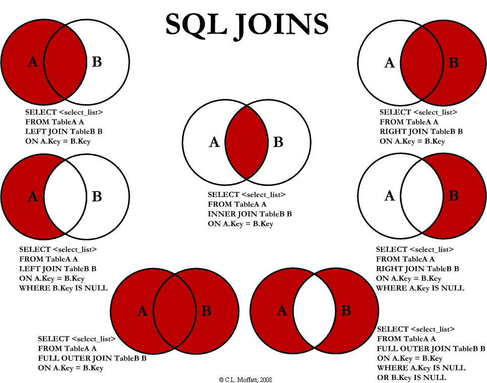

# common-interview-topics
This is a sample app that will help you with your review of RestAPI, Java Streams and SQL queries

## Project Setup
[Spring Initializer](https://start.spring.io)

## REST API

## Java Streams
From link: [https://stackify.com/streams-guide-java-8/](https://stackify.com/streams-guide-java-8/)

* forEach()
* filter()
* parallel()
* map()
* flatMap()
* reduce()
* findFirst()
* toArray()
* toList()

## SQL Queries (JOIN)

## Spring Boot Application Architecture
